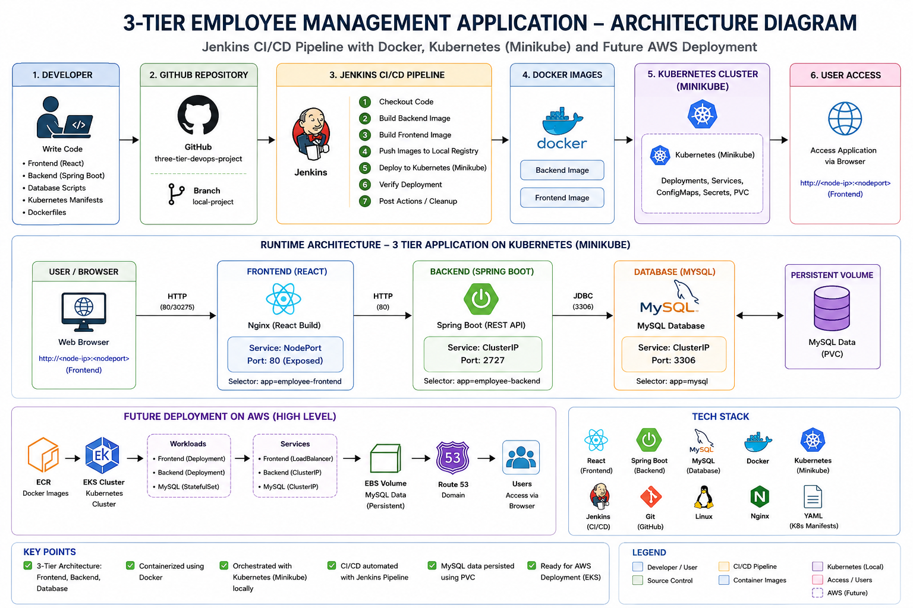

# HR Management Site

This is a simple site built using Express, Node.js, React.js, and MYSQL in order to keep track of employees at a company. 

# Running Locally 

To run this site locally, it is necessary to install all required npm packages and libraries located in the `requirements.txt` folder. In addition, it is necessary to setup a local MYSQL database entitled `employeeSystem` with a table entitled `employees`.

## Cloning 

```
git clone https://github.com/farooqashar/employees.git
```

## Installing requirements 

```
npm install
```

## Starting Frontend Server 

```
cd client
npm start
```

Locate to `http://localhost:3000/` to see frontend server.

## Starting Backend Server

```
cd server
node index.js
```
The backend server is located at `http://localhost:2727/`.

**Front Page of Site**


**Showing Employees on the Site**


**Example of MYSQL Database**


## Architecture Diagram

The following diagram shows the 3-tier application architecture, Jenkins CI/CD pipeline, Docker, Kubernetes (Minikube), and future AWS deployment.



